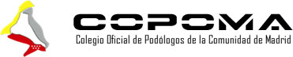
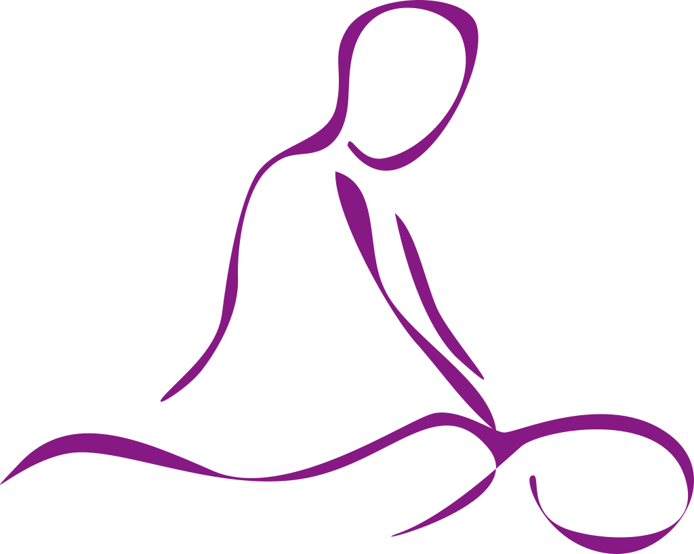
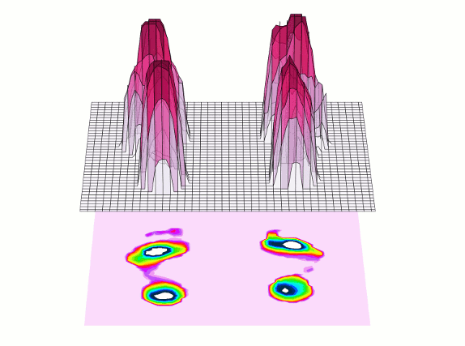
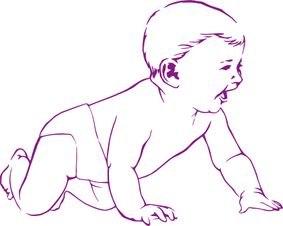
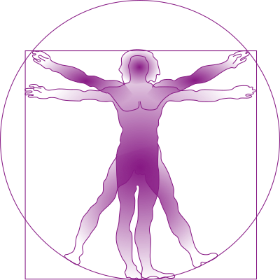

# Estelapefer

## Estela Pérez Fernández 

* Fisioterapeuta colegiada número 5951
{: style="float: right; width: 25%"}

* Podóloga colegiada número 2411
{: style="float: right; width: 25%"}

## Contacto

* [estelapefer@gmail.com](mailto: estelapefer@gmail.com)
* [679492845](tel: 679492845)
* [whatsapp](https://wa.me/679492845)

# Servicios

Con la visión global del cuerpo humano que aporta la fisioterapia, la podología se convierte en una disciplina mucho más completa e integrativa.

La conjunción de ambas permite entender correctamente la postura y la marcha humanas y diagnosticar con precisión el origen de los problemas para tratarlos de una forma mucho más efectiva.

## Fisioterapia

{: style="float: right; width: 25%"}

* Reeducación postural y escuela de espalda
* Lesiones traumatológicas (esguinces, fracturas, contusiones…)
* Contracturas musculares y sobrecargas
* Tratamientos postquirúrgicos
* Lesiones deportivas
* Drenaje linfático manual

## Estudio Biomecánico de la Marcha

{: style="float: left; width: 25%"}

* Estudio dinámico y estático para valorar la marcha y la carrera, con plataforma baropodométrica.
* Evaluación y mejora del gesto deportivo.
* Confección de plantillas ortopédicas y deportivas.

## Suelo Pélvico

* Embarazo y postparto
* Incontinencia urinaria
* Gimnasia abdominal hipopresiva

## Infantil

{: style="float: right; width: 25%"}

* Fisioterapia respiratoria
* Tratamiento anticólicos
* Lesiones neurológicas
* Prematuros
* TDAH

## Estudios Posturales

### ¿Qué es la posturología?

{: style="float: left; width: 25%"}

Cualquier disfunción en alguno de los captores posturales (vista, oído, pie, mandíbula, columna vertebral) determinará que la información que éstos mandan al sistema nervioso central  sea errónea, por tanto nuestra postura será deficiente, dando lugar a dolores crónicos y de repetición.

La posturología estudia e integra el sistema postural fino. 
Mediante la realización de test clínicos y precisas mediciones en plataforma baropodométrica podremos determinar cuál es la causa primaria de la disfunción para tratarla después (con plantillas posturales, ejercicios, fisioterapia o derivando al profesional indicado en cada caso).

### ¿A quién va dirigido?

Principalmente a todos aquellos pacientes con dolor musculoesquelético cronificado (lumbalgias, cervicalgias, ciáticas…) que responde al tratamiento (mejora tras una sesión de fisioterapia o una infiltración) pero vuelve a recaer periódicamente. También es muy útil en pacientes con migrañas, vértigos, insomnio, cansancio generalizado, niños con déficit de atención e hiperactividad, etc.
